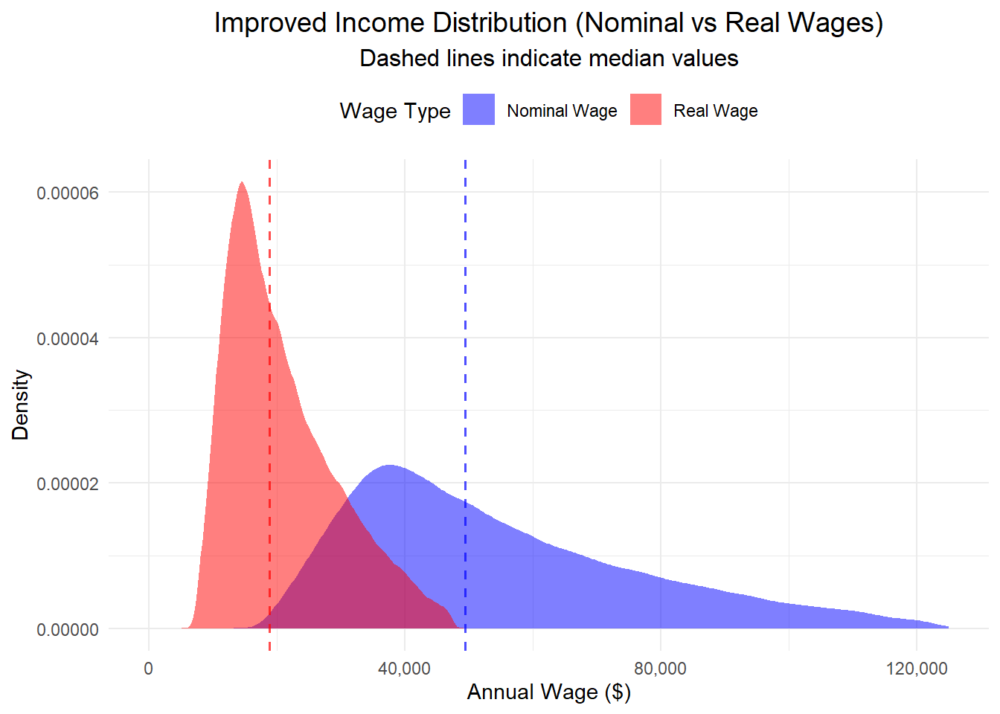
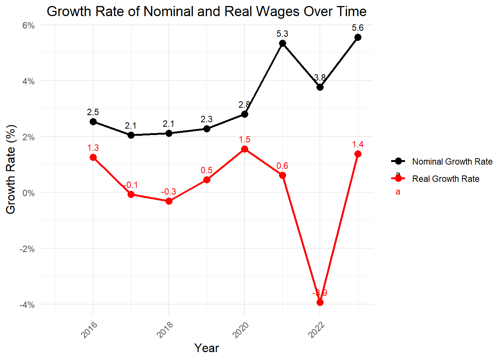
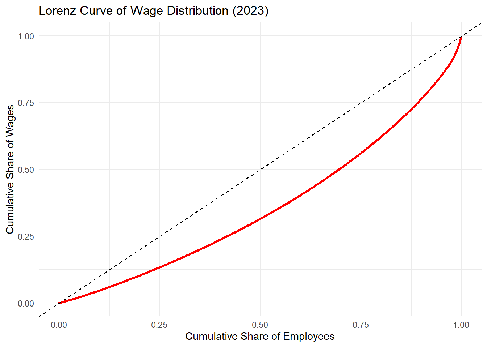
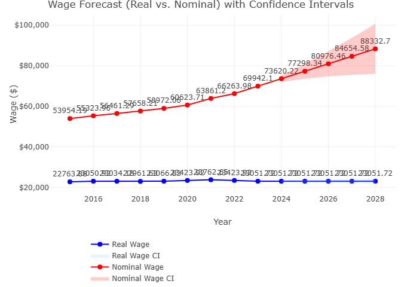

# CPI-Wage-Disparity-Statistical-Analysis

## 🌐 View the Full Analysis

**[Reasearch Paper](https://drive.google.com/file/d/18HR4KMFGG_lo_uHUVQUe4kU1ecduZy76/view?usp=sharing)** 

**[View Full RMD Report](https://christianlg2.github.io/CPI-Wage-Disparity-Statistical-Analysis/cpi_wage_trend_analysis.html)**  

Or, clone the repository and open the `.Rproj` in RStudio to reproduce the analysis locally.

## 📌 Introduction
In an era of economic challenges, where inflation and wage growth compete for dominance in shaping financial stability, understanding their interplay has become crucial. Inflation, often measured by the **Consumer Price Index (CPI)**, reflects the rising cost of goods and services over time, eroding the purchasing power of households. Wages, serving as the primary source of income for most individuals, are central to determining the ability to navigate these inflationary pressures. Together, these factors form the cornerstone of economic equity and sustainability.

While wages have shown growth in various sectors, persistent questions remain:  
- Are real wages (adjusted for inflation) truly keeping pace with rising costs, or are workers experiencing a quiet erosion of their purchasing power?  
- Which regions or states demonstrate resilience, and which are more vulnerable?  
- What patterns emerge when wage fluctuations are analyzed over time and across sectors?  
- How has economic inequality evolved, and what lessons can be drawn for wage forecasting?

This analysis addresses these questions by applying a robust framework of **statistical methods** and **visualizations** to evaluate wage dynamics over time.

## 🎯 Objectives
The goal of this analysis is to provide a comprehensive understanding of the relationship between wages and inflation, using CPI as the primary measure of inflation.

Specifically, this analysis aims to:

- **Understand Trends in CPI** – Analyze yearly and monthly CPI trends to identify patterns of inflation.
- **Examine Wage Trends** – Compare the evolution of nominal and real wages to assess whether purchasing power has kept up with inflation.
- **Evaluate Geographic Wage Disparities** – Investigate how wage growth differs across states and regions.
- **Assess Wage Inequality** – Measure trends in wage inequality using quantile analysis and the Gini index.
- **Correlate Wages and Inflation** – Examine the relationship between wage growth and inflation to uncover systemic trends.
- **Forecast Future Trends** – Project wage growth into the future to provide actionable insights.

## ❓ Key Questions & Hypotheses

| **Research Question** | **Null Hypothesis (H₀)** | **Alternative Hypothesis (Hₐ)** |
|----------------------|-------------------------|--------------------------------|
| Are real wages keeping up with inflation? | No significant difference between nominal and real wages. | Significant difference between nominal and real wages. |
| Are some states more stable than others? | No significant difference in wage fluctuations across states. | Significant differences in wage fluctuations across states. |
| Has wage inequality evolved over time? | No significant change in the Gini coefficient over time. | Gini coefficient has significantly changed over time. |
| Are larger households more likely to fall below poverty line? | Poverty likelihood is independent of household size. | Larger households are more likely to fall below poverty line. |
| Are wage changes consistent year-over-year? | Year-over-year wage changes remain consistent. | Wage changes show significant variability over time. |
| Can wages be forecasted accurately? | ARIMA models do not provide accurate predictions. | ARIMA models provide accurate predictions within confidence intervals. |
| Do real and nominal wages follow different trends? | Real and nominal wages follow the same trend. | Real and nominal wages follow significantly different trajectories. |
| Are there significant geographic disparities? | Average wages do not vary significantly across states. | Average wages vary significantly across states. |
| Do real wages keep households above poverty thresholds? | Real wages are sufficient to keep workers above poverty. | Real wages are insufficient, especially for larger households. |

## 🧮 Statistical Methods

This project uses a range of statistical techniques:

- **Descriptive Statistics** – Means, medians, and ranges for CPI and wages.
- **ANOVA** – To test for significant differences across months, years, and regions.
- **Correlation Analysis** – To measure strength and direction of CPI–wage relationship.
- **Regression Analysis** – To quantify wage growth versus inflation.
- **Quantile Analysis** – To assess wage distribution and inequality.
- **Gini Index** – To measure income/wage inequality.
- **Time Series Analysis (ARIMA)** – To forecast future wage growth.
- **Data Visualization** – Line charts, scatter plots, box plots, and animations for communication of results.

## 🖼️ Demo Charts
Below are selected key visualizations from the analysis:

| Nominal vs Real Wages | Wage Growth Rate |
|----------------------|-----------------|
|  |  |

| Lorenz Curve (Inequality) | Wage Forecast |
|--------------------------|--------------|
|  |  |

## 🗂️ Project Structure

| File/Folder | Description |
|-------------|-------------|
| `docs/cpi_wage_trend_analysis.html` | Rendered HTML report with interactive analysis and visualizations |
| `CPI-Wage-Disparity-Statistical-Analysis.Rproj` | RStudio project file for reproducible analysis |
| `data/` | (Optional) Raw and processed datasets (may be `.gitignored` if too large) |
| `README.md` | This documentation |

## 📊 Key Insights (to be summarized)

- Summary of CPI vs. wage trends (add when ready).
- Key statistical test results.
- Forecasting highlights.

## 📜 License
This project is open for educational and research purposes. You may fork and adapt it with proper attribution.

## ✨ Author
**Christian Lira Gonzalez**  
Business Analytics | Data Science Enthusiast  
[LinkedIn](https://www.linkedin.com/in/christianlg/) | [Portfolio](https://www.clirago.com)
