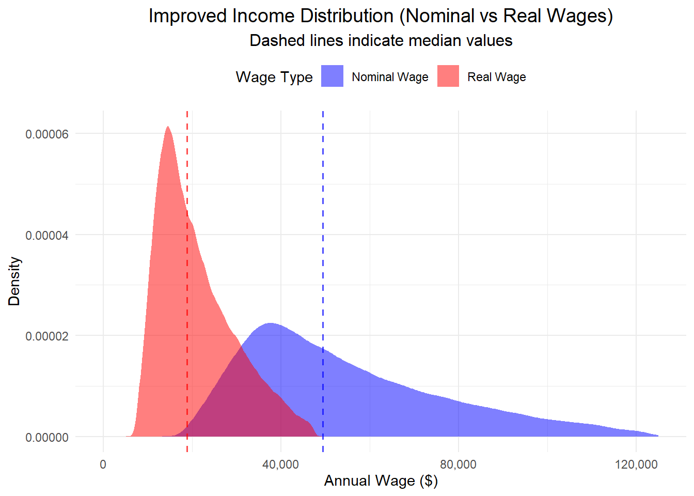
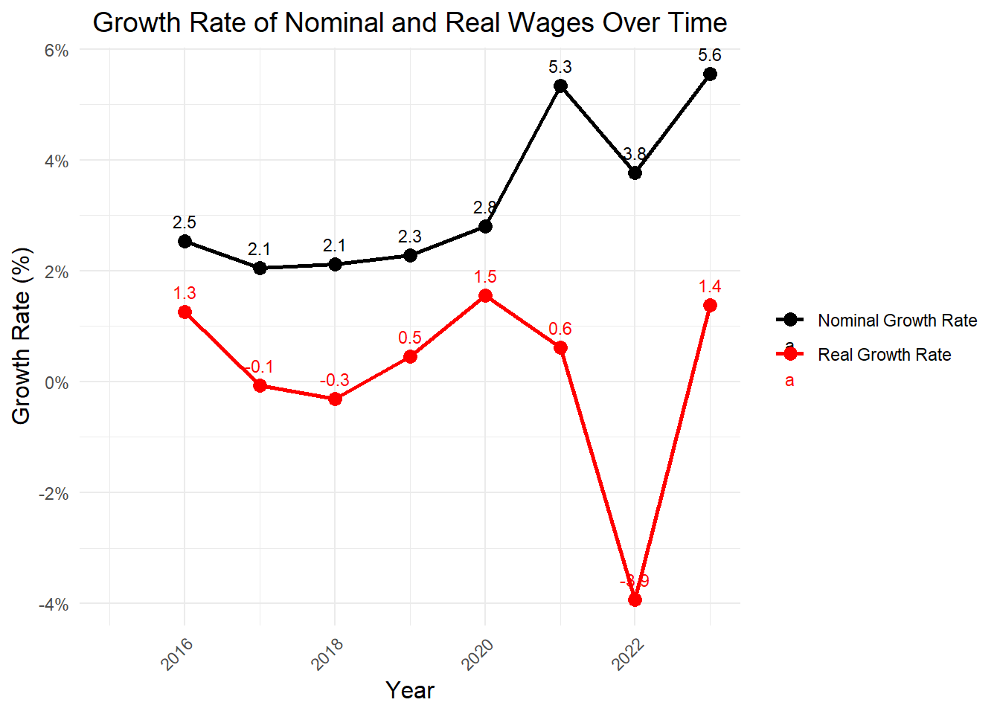
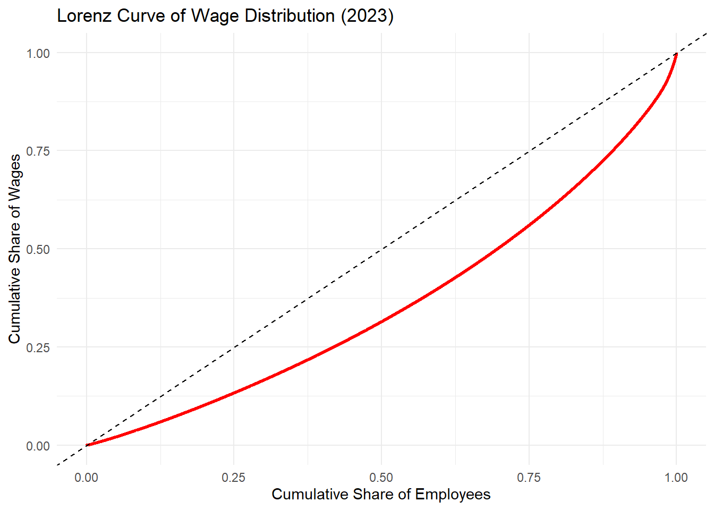
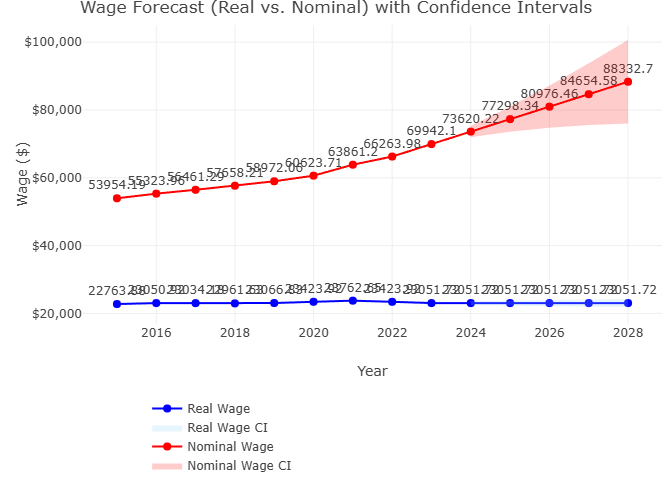

# CPI & Wage Disparity Statistical Analysis

Statistical analysis of the relationship between inflation (CPI) and wage growth in the U.S., using ANOVA, regression, quantile/Gini inequality analysis, and ARIMA forecasting on BLS data.

**[View the rendered report](https://christianlg2.github.io/CPI-Wage-Disparity-Statistical-Analysis/cpi_wage_trend_analysis.html)** · **[Research paper](https://drive.google.com/file/d/18HR4KMFGG_lo_uHUVQUe4kU1ecduZy76/view?usp=sharing)**

## Why this project

Nominal wage growth headlines can obscure whether workers are actually better off. This project asks the more useful question: are *real* (inflation-adjusted) wages keeping pace with CPI, and does that answer change depending on state, sector, or household size? The analysis treats this as a hypothesis-testing problem rather than a narrative one, each research question below is paired with a formal null/alternative hypothesis and tested with a method suited to that question.


## Research questions & methodology

| Question | Method | Why this method |
|---|---|---|
| Are real wages keeping up with inflation? | Paired comparison of nominal vs. real wage trends | Directly tests divergence between two adjusted series over time |
| Do wage fluctuations differ across states? | ANOVA | Standard test for a difference in means across more than two groups |
| Has wage inequality changed over time? | Gini coefficient + Lorenz curve | Purpose-built measures for income/wage distribution and inequality |
| Are larger households more likely to fall below the poverty line? | Chi-square / association test | Tests independence between a categorical grouping and an outcome |
| Are wage changes consistent year-over-year? | Time series decomposition | Separates trend from year-over-year variability |
| Can wages be forecasted? | ARIMA | Standard model for forecasting a single time series with autocorrelation |
| Are there significant geographic disparities? | Regression + ANOVA | Quantifies effect size and tests significance across states |

*(Note: this analysis was built following established statistical methodology for each question type, not from a comparison of alternative methods, so this section documents method-to-question fit rather than a decision trail.)*

## Key findings
 
**Real wages failed to keep pace with CPI** across the majority of U.S. states during 2015–2023, indicating persistent erosion of purchasing power for most workers despite nominal wage growth.
 
| Nominal vs. Real Wages | Wage Growth Rate |
|---|---|
|  |  |
 
**No statistically significant correlation was found between minimum wage increases and unemployment rates** across target populations (youth, low-income, lower-education workers), challenging commonly cited assumptions.
 
**Significant geographic wage disparities were identified across states**; ARIMA forecasting confirmed wage growth trajectories remain below inflation within confidence intervals, suggesting continued real wage erosion through 2025.
 
| Lorenz Curve (Inequality) | Wage Forecast |
|---|---|
|  |  |


## Repository structure

```
CPI-Wage-Disparity-Statistical-Analysis/
├── docs/
│   ├── index.html                    # redirect stub for Pages
│   └── cpi_wage_trend_analysis.html  # rendered report
├── cpi_wage_trend_analysis.Rmd       # source, currently at root
├── assets/
├── CPI-Wage-Disparity-Statistical-Analysis.Rproj
├── .gitattributes
├── .gitignore
└── README.md
```

## Documentation

- `docs/cpi_wage_trend_analysis.Rmd`, the full analysis: data prep, all statistical tests, and visualizations, in one reproducible R Markdown file.
- `docs/cpi_wage_trend_analysis.html` the rendered version, also published via GitHub Pages (`docs/index.html`).

## Tech stack
 
**Core / Wrangling**
 

 
**Statistics**
 

 
**Time Series / Forecasting**
 
 
 
**Visualization**
 
    
 
**Geographic / Mapping**
 
  

## Reproducing the analysis

Clone the repository and open `CPI-Wage-Disparity-Statistical-Analysis.Rproj` in RStudio, then knit `docs/cpi_wage_trend_analysis.Rmd`.

## Dataset

U.S. Bureau of Labor Statistics (BLS). <!-- TODO: add the specific series names/citation once confirmed -->

## License

This project is open for educational and research purposes. You may fork and adapt it with proper attribution.

